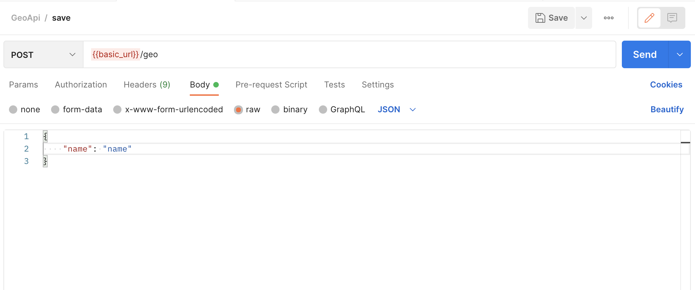

## General info
Backend Flask project with JWT authorization which is able to store info about geolokalization

## Setup
To run this project, you can run remote container by dockerfile in VS Code or build image and then run such komand:

```
$ cd <get to dockerfile directory>
$ docker build . -f Dockerfile -t <image> --no-cache --pull
$ docker run -p 8080:5000 -d <image>
```

## ./register
Save user in database according to json body


## ./login
Login user using his name and passsword in Basic Auth and as response we obtaining token by which we authorize our user


## ./users
list of all users in DB

## ./geo 
Saving geo information of user accroding to thier ip address and authorizated by token in x-access-tokens header and raw Body



## ./geo_info
showing geoinfo according to token and user id


## ./geo_info/id
Deleting user geo information accoridng to token and user id

